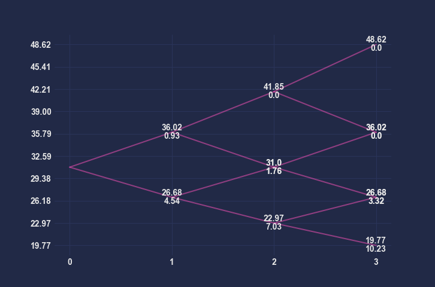

# Option Pricer
This is a Python project made to apply what I've learned about option pricing during my MSc in Finance.
## References
1. Hull, J. (2014) Options, Futures and Other Derivatives. 9th Edition
2. A Black–Scholes user’s guide to the Bachelier model: https://arxiv.org/pdf/2104.08686.pdf 
3. Iacus, S.M. (2011) Option Pricing and Estimation of Financial Models with R

## How to run
1. Clone the repository or download it as ZIP file
2. Run ```pip install -r requirements.txt``` (optional)
3. Run ```main.py [arguments]```

## Requirements
* `numpy`
* `scipy`
* `matplotlib`

## Usage
* Supported underlying assets:
  * Dividend and non-dividend paying stocks
  * Currencies
  * Commodities
  * Futures

| Argument | Description                                                                                                                                                                                                                                                                                                         |
|----------|---------------------------------------------------------------------------------------------------------------------------------------------------------------------------------------------------------------------------------------------------------------------------------------------------------------------|
| h        | **Print help message**                                                                                                                                                                                                                                                                                              |
| m        | **Pricing Method** <ul> <li>Black-Scholes model, `-m BS`</li> <li>Bachelier model, `-m BA` </li> <li>Binomial Tree, `-m BT`</li> <li>Monte Carlo Simulation, `-m MC`</li> </ul>                                                                                                                                     |
| p        | **Product**. The option type to price: <ul> <li>European options: `EUC` (call), `EUP` (put)</li> <li>American options: `USC` (call), `USP` (put)</li> <li>Futures-style options: `FSTYLEC` (call), `FSTYLEP` (put)</li> <li>Bond options: `BC` (call), `BP` (put)</li> </ul>                                        |
| s        | **Spot Price**                                                                                                                                                                                                                                                                                                      |
| f        | **Forward Price**                                                                                                                                                                                                                                                                                                   |
| k        | **Strike Price**                                                                                                                                                                                                                                                                                                    |
| r        | **Annualized Risk Free Rate**                                                                                                                                                                                                                                                                                       |
| rf       | **Annualized Foreign Risk Free Rate**                                                                                                                                                                                                                                                                               |
| u        | **Annualized Storage Cost**                                                                                                                                                                                                                                                                                         |
| q        | **Annualized Dividend Yield**                                                                                                                                                                                                                                                                                       |
| d        | **Dividends**. List of expected discrete dividends. e.g. three semi-annual dividends of 0.5$: `-d 0.5 0.5 0.5`                                                                                                                                                                                                      |
| dt       | **Dividend Times**. It refers to the times in which the dividends will be paid. In the example above we'll set: `-dt 0.5 1 1.5`                                                                                                                                                                                     |
| t        | **Time to Expiration**. It can be expressed in different ways:<ul> <li>Years, using only a float value e.g. `-t 1` </li> <li>Months, by adding "m" or "months" to a number e.g `-t 12 m` </li> <li>Weeks, by adding "w" or "weeks" e.g. `-t 52 w`</li> <li>Days, by adding "d" or "days" e.g. `-t 252 d`</li> </ul> |
| vol      | **Annualized Log-Normal Volatility**. The volatility used in Black-Scholes model and Binomial Trees.                                                                                                                                                                                                                |
| nvol     | **Annualized Normal Volatility**. The volatility used in the Bachelier model. <br/>If it isn't included when the Bachelier pricing model is selected, the tool will automatically convert log-normal volatility in normal volatility.                                                                               |
| b        | **Current Bond Cash Price**                                                                                                                                                                                                                                                                                         |
| i        | **PV of Bond's Income**                                                                                                                                                                                                                                                                                             |
| steps    | **Number of Steps**. Number of steps to use in the binomial tree.                                                                                                                                                                                                                                                   |
| print    | **Print the Binomial Tree**                                                                                                                                                                                                                                                                                         |
| greeks   | **Print the Values of Delta, Theta, Gamma, Vega and Rho**                                                                                                                                                                                                                                                           |
| n        | **Number of Simulations**                                                                                                                                                                                                                                                                                           |
| process  | **Underlying process** <ul> <li>Geometric Brownian Motion, `-process GBM`</li> <li>Variance-Gamma Process, `-process VG` </li> <li>Merton Jump Process, `-process MJ`</li> </ul>                                                                                                                                    |
| params   | **List of Process' Parameters.** e.g. jumps' intensity, mean and standard deviation of jumps' distribution                                                                                                                                                                                                          |


## Examples
### European option

A financial institution has just sold 1,000 seven-month European call options on the Japanese yen. Suppose that the spot exchange rate is 0.80 cent per yen, the exercise price is 0.81 cent per yen, the risk-free interest rate in the United States is 8% per annum, the risk-free interest rate in Japan is 5% per annum, and the volatility of the yen is 15% per annum. Calculate the delta, gamma, vega, theta, and rho of the financial institution’s position. Interpret each number

#### Black-Scholes
Input: 
```bash
python main.py -p EUC -s 0.8 -k 0.81 -r 0.08 -rf 0.05 -vol 0.15 -t 7 m -greeks
```

Output: 

```bash
INFO - pricers - Pricing using Black-Scholes
INFO - main - The option price is: 0.03741
INFO - main - The Greeks are: Theta -0.03989 | Delta 0.52493 | Gamma 4.20593 | Vega 0.23553 | Rho 0.22315
```
#### Bachelier
Input: 
```bash
python main.py -p EUC -s 0.8 -k 0.81 -r 0.08 -rf 0.05 -vol 0.15 -t 7 m -m BA
```

Output: 

```bash
INFO - pricers - Pricing using Bachelier
INFO - main - The option price is: 0.03751
```
#### Monte Carlo Simulation under GBM
Input: 
```bash
python main.py -p EUC -s 0.8 -k 0.81 -r 0.08 -rf 0.05 -vol 0.15 -t 7 m -m MC -n 5000
```

Output: 

```bash
INFO - pricers - Pricing using Monte Carlo Simulation
INFO - pricers - Pricing under Geometric Brownian Motion
INFO - main - The option price is: 0.03679
```
#### Monte Carlo Simulation under Variance-Gamma process
Input: 
```bash
python main.py -p EUC -s 0.8 -k 0.81 -r 0.08 -rf 0.05 -vol 0.15 -t 7 m -m MC -n 5000 -process VG -params 0.02 1
```

Output: 

```bash
INFO - pricers - Pricing using Monte Carlo Simulation
INFO - pricers - Pricing under Variance Gamma Process
INFO - main - The option price is: 0.04568
```
### European option (dividend)
Consider a European call option on a stock when there are ex-dividend dates in
two months and five months. The dividend on each ex-dividend date is expected
to be $0.50. The current share price is $40, the exercise price is $40, the stock price
volatility is 30% per annum, the risk-free rate of interest is 9% per annum, and
the time to maturity is six months.

Input: 
```bash
python main.py -p EUC -d 0.5 0.5 -dt 0.16667 0.41667 -s 40 -k 40 -vol 0.3 -r 0.09 -t 0.5
```

Output: 

```bash
INFO - pricers - Pricing using Black-Scholes
INFO - main - The option price is: 3.67123
```

### Futures-style option
The strike price of a futures option is 550 cents, the risk-free rate of interest is 3%, the volatility of the futures price is 20%, and the time to maturity of the option is 9 months. The futures price is 500 cents ... (d) What is the futures price for a futures style option if it is a call?

Input: 
```bash
python main.py -p FSTYLEC -f 5 -k 5.5 -r 0.03 -vol 0.2 -t 0.75
```

Output: 

```bash
INFO - pricers - Pricing using Black-Scholes
INFO - main - The option price is: 0.16564
```


### Bond option
Use the Black’s model to value a one-year European put option on a 10-year bond. Assume that the current value of the bond is $125, the strike price is $110, the one-year risk-free interest rate is 10% per annum, the bond’s forward price volatility is 8% per annum, and the present value of the coupons to be paid during the life of the option is $10


Input: 
```bash
python main.py -p BC -b 105 -i 34.968 -r 0.1 -t 4 -vol 0.02 -k 100
```

Output: 

```bash
INFO - pricers - Pricing using Black-Scholes
INFO - main - The option price is: 3.19007
```

### American Option 

Three-step tree to value an American 9-month put option on a
futures contract when the futures price is 31, strike price is 30, risk-free rate is 5%,
and volatility is 30%


Input: 
```bash
python main.py -m BT -steps 3 -p USP -f 31 -k 30 -r 0.05 -vol 0.3 -t 9 m -print
```

Output:
```bash
INFO - pricers - Pricing using Binomial Tree
INFO - main - The option price is: 2.83564
```

<p align="center">
  
</p>

